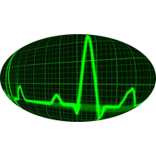

# NarcoCalc

> **⚠️ MOVED TO GITHUB:** This project is now maintained on GitHub.
>
> **🔗 New Location:** [https://github.com/Peuqui/NarcoCalc](https://github.com/Peuqui/NarcoCalc)
>
> **🌐 Live Demo:** [https://peuqui.github.io/NarcoCalc](https://peuqui.github.io/NarcoCalc)

[comment]: # "Bild: Modified: gemeinfrei - PublicDomainPictures/ Pixabay / CC0"
[comment]: # "Modified from: https://pixabay.com/illustrations/pulse-trace-healthcare-medicine-163708/"
[comment]: # 'Pixabay-Lizenz: "You can copy, modify, distribute, and use the images, even for commercial purposes, all without asking for permission or giving credits to the artist. However, depicted content may still be protected by trademarks, publicity or privacy rights." '

## Description

This project is designed as a "Progressive Web App" made with the framework "Vue.js". It is a responsive "Single Page Application" which calculates some anaesthesia-related parameters.
 
These calculations are just made as a demo and shall NOT used for therapy purposes.
 
No responsibility is assumed!

## Project setup

yarn install
 
(npm install -n 12.0.0)
 
nvm use 12.0.0

### Compiles and hot-reloads for development

yarn run serve
 
or
 
npm serve

### Compiles and minifies for production

yarn run build

### Install dependency

yarn add vue-numeric-input

(yarn add pouchdb <- not yet implemented)

Windows 10: in case this fails due to "leveldown", do this in a Powershell as Admin:

npm install -g --production windows-build-tools

### Live Demo

https://peuqui.github.io/NarcoCalc

### GitHub Actions Status

## Version History

### Version 2.1.0 (August 2025)
- **NEW**: Lemmens formula for obese patients (BMI >30)
  - Automatic switching at BMI ≥35
  - Transition zone BMI 30-35 with weighted mixing
  - Up to 26% more accurate blood volume calculation for obesity
- **NEW**: Time-based correction factor based on eviscerated OR time
  - -15% for <2h, -10% for 2-4h, -5% for 4-6h operations
  - Additional -5% correction for >30ml/kg crystalloid administration
- **IMPROVED**: Enhanced comparison view with corrected values
- **IMPROVED**: Better color contrast for readability on green background
- Comprehensive documentation of analysis and implementation

### Version 2.0.0 (July 2025)
- **NEW**: Logarithmic blood loss calculation (physiologically more accurate)
- **NEW**: Comparison view showing both logarithmic and linear calculation methods
- Blood loss formula now uses: BV × ln(HKpräop / HKaktuell) + EK/MAT correction
- Linear calculation still available for comparison (shown in orange)
- Improved accuracy especially for large blood losses with extensive fluid therapy
- Migration from GitLab to GitHub

### LICENSE

published under the MIT License

### Sponsor-Logo

### License of the NarcoCalc logo

The logo was modified from a picture ( https://pixabay.com/de/illustrations/pulslinie-gesundheitswesen-medizin-163708/ ) published under the pixabay free license ( https://pixabay.com/de/service/license/, https://pixabay.com/de/service/terms/#license ).
